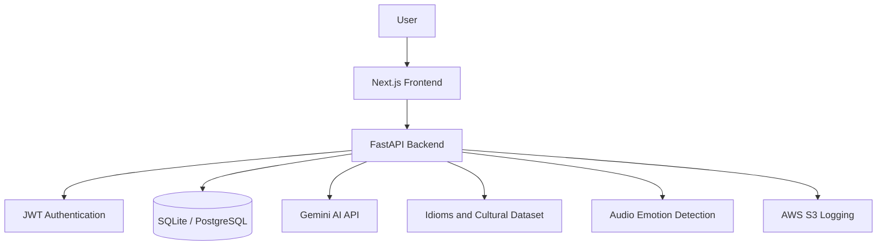

# Vaakya - Smart Cultural Translator

Vaakya is a full-stack AI translation platform built to improve contextual and cultural understanding beyond literal translation systems. It combines a FastAPI backend, a Next.js frontend, Google Gemini AI integration, curated idiom data, slang interpretation, emotional mismatch detection, and voice translation workflows to help users understand not only what a sentence says, but what it means in context.

The project is designed as a professional final-year project, GitHub portfolio project, and viva-ready demonstration of applied AI, backend engineering, frontend development, and cloud-aware MLOps practices.

## Features

- Context-aware translation that considers idioms, cultural expressions, and intended meaning.
- Slang interpretation for informal, Gen-Z, and culturally specific phrases.
- Emotional mismatch detection between sentence meaning and detected voice tone.
- Voice translation support for spoken-input translation workflows.
- Gemini AI integration for intelligent translation, slang explanation, and contextual analysis.
- FastAPI REST API with authentication, translation history, health checks, and modular endpoints.
- Next.js frontend for translation, dashboard, authentication, and history screens.
- SQLAlchemy-based data layer with support for local and containerized database usage.
- AWS S3-oriented logging support for MLOps and translation event tracking.
- Docker-based setup for backend, frontend, and database orchestration.

## Tech Stack

**Frontend**

- Next.js
- React
- TypeScript
- Axios
- CSS Modules / global styling

**Backend**

- FastAPI
- Python
- Uvicorn
- Pydantic
- SQLAlchemy
- JWT authentication

**AI and ML**

- Google Gemini API
- Google Generative AI SDK
- Hugging Face Transformers
- Torch / Torchaudio
- Audio emotion classification

**Data and Infrastructure**

- SQLite for local development
- PostgreSQL for containerized deployment
- AWS S3 integration for logging
- Docker and Docker Compose
- DVC pipeline configuration

## System Architecture Overview

Vaakya follows a FastAPI + Next.js architecture.



The frontend sends user requests to the FastAPI backend through REST APIs. The backend handles authentication, translation workflows, slang analysis, emotion detection, history storage, Gemini API calls, dataset lookups, and optional AWS S3 logging.

## Installation Steps

### Prerequisites

- Python 3.10 or later
- Node.js 18 or later
- npm
- Docker and Docker Compose, if running the containerized setup
- Google Gemini API key
- AWS credentials, only if using S3 logging/deployment features

### Clone the Repository

```bash
git clone https://github.com/<your-username>/vaakya-mlops.git
cd vaakya-mlops
```

## Backend Setup

```bash
cd backend
python -m venv venv
venv\Scripts\activate
pip install -r requirements.txt
uvicorn app.main:app --reload --port 8000
```

For Linux or macOS:

```bash
cd backend
python -m venv venv
source venv/bin/activate
pip install -r requirements.txt
uvicorn app.main:app --reload --port 8000
```

The backend API will run at:

```text
http://localhost:8000
```

FastAPI Swagger documentation is available at:

```text
http://localhost:8000/docs
```

## Frontend Setup

```bash
cd frontend
npm install
npm run dev
```

The frontend will run at:

```text
http://localhost:3000
```

## Environment Variables

Secrets must be stored locally in `.env` files and must not be committed to GitHub. This repository includes `.env.example` files for safe reference.

### Backend Environment

Create `backend/.env`:

```env
POSTGRES_USER=postgres
POSTGRES_PASSWORD=password
POSTGRES_DB=vaakya
DATABASE_URL=postgresql+asyncpg://postgres:password@db:5432/vaakya

SECRET_KEY=generate_a_secure_random_key_here
ALGORITHM=HS256
ACCESS_TOKEN_EXPIRE_MINUTES=30

GEMINI_API_KEY=your_gemini_api_key_here

AWS_ACCESS_KEY_ID=your_aws_access_key
AWS_SECRET_ACCESS_KEY=your_aws_secret_key
AWS_REGION=us-east-1
S3_BUCKET_NAME=vaakya-data-bucket
```

### Frontend Environment

Create `frontend/.env.local` if needed:

```env
NEXT_PUBLIC_API_URL=http://localhost:8000
```

## AWS Deployment Overview

The project includes deployment-oriented configuration while keeping deployment behavior unchanged.

- Dockerfiles are available for backend and frontend services.
- `docker-compose.yml` supports multi-service orchestration.
- PostgreSQL can be used as the production/container database.
- AWS S3 integration is available for logging translation and MLOps-related data.
- Deployment credentials should be provided through secure environment variables, never committed files.
- Existing AWS and deployment-related files should remain intact when preparing the repository for submission or portfolio use.

## Gemini API Integration

Vaakya uses Google Gemini AI through the Google Generative AI SDK. Gemini is used to improve cultural translation quality, interpret informal language, explain slang, and analyze contextual meaning. The backend reads the Gemini API key from environment variables and routes AI-powered requests through service modules instead of exposing the key to the frontend.

This integration helps the system move beyond direct word substitution by considering intent, tone, cultural meaning, and phrasing.

## Slang Interpretation

The slang interpretation feature analyzes informal expressions, internet slang, Gen-Z language, and culturally dependent phrases. Instead of only translating words literally, it explains the actual meaning in plain language and can provide context-aware interpretation in the target language.

This is useful for phrases whose meaning changes based on social context, region, sarcasm, humor, or modern usage.

## Emotion Detection

Vaakya includes emotion-aware functionality for detecting tone from voice input and comparing it with the emotional meaning of the spoken text. This enables emotional mismatch detection, such as identifying when a happy tone conflicts with sad or serious sentence meaning.

The feature helps improve communication accuracy by highlighting cases where literal text alone may not represent the speaker's emotional intent.

## Voice Translation

The voice translation workflow supports translation from spoken or voice-derived input. The backend can process voice translation requests, apply contextual translation logic, and use Gemini-powered translation when appropriate.

This makes the system more practical for real-world multilingual conversations where users speak naturally rather than typing formal sentences.

## Screenshots

Add screenshots before final submission or portfolio publication.

### Dashboard

Placeholder: Add dashboard screenshot here.

### Translation Screen

Placeholder: Add translation screen screenshot here.

### Slang Analysis

Placeholder: Add slang interpretation screenshot here.

### Emotion Detection

Placeholder: Add emotion mismatch detection screenshot here.

### Translation History

Placeholder: Add translation history screenshot here.

## Future Enhancements

- Add more regional slang and idiom datasets.
- Improve multilingual voice transcription support.
- Add user-selectable translation styles such as formal, casual, and academic.
- Add analytics dashboards for translation quality and usage trends.
- Improve deployment automation with CI/CD pipelines.
- Add more robust evaluation metrics for cultural translation accuracy.
- Expand support for additional cloud storage and monitoring tools.

## Contributors

- Ankit-1207

## License

This project is intended for academic, portfolio, and demonstration use. Add a formal license file, such as MIT License, before public distribution if required.
