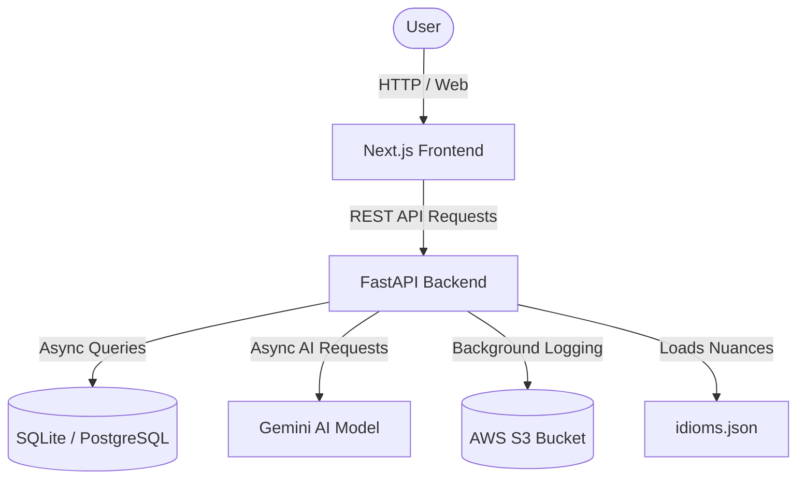

<div align="center">
  <h1>🌐 Vaakya MLOps: Smart Cultural Translator</h1>
  <p>A full-stack MLOps intelligent translation platform capturing idioms, cultural nuances, and context, powered by AI.</p>

  <!-- Badges -->
  
  
  
  
  
</div>

<br />

## 📖 Overview

**Vaakya** is a complete end-to-end MLOps solution designed to go beyond literal text translation. By integrating a vast dataset of idioms and cultural expressions, it uses Google's **Gemini AI** to perform context-aware, culturally sensitive translations. 

This project incorporates robust backend services using **FastAPI**, an asynchronous database architecture (**SQLite/PostgreSQL** with **SQLAlchemy**), secure JWT-based authentication, background tasks for S3 data logging, and a stunning, glassmorphic UI built with **Next.js** and **Tailwind CSS**.

---

## ✨ Key Features

- **🧠 Context-Aware Translations**: Leverages the Gemini API and a dedicated `idioms.json` dataset to capture cultural nuances.
- **⚡ High-Performance Backend**: Built on FastAPI with fully asynchronous endpoints to prevent blocking operations and ensure smooth streaming.
- **🔐 Secure Authentication**: JWT-based login and registration system with secure password hashing.
- **📝 Translation History**: Persistent user-specific history for previously translated texts.
- **☁️ MLOps Integration**: Built-in tracking and logging pipelines designed for DVC (Data Version Control) and AWS S3 integration via background tasks.
- **🎨 Glassmorphic UI**: A premium, responsive interface featuring modern web aesthetics and smooth micro-animations.

---

## 🏗️ Architecture



### Component Stack
- **Frontend Layer**: Next.js 14+, React 19, Tailwind CSS, Axios.
- **Backend API Layer**: FastAPI, Uvicorn.
- **Data & Auth Layer**: SQLAlchemy (async driver), Passlib, python-jose (JWT).
- **ML & Infrastructure**: Gemini SDK, DVC for dataset versioning, Docker for containerization.

---

## 📁 Project Structure

```text
Vaakya-Smart-Cultural-Translator/
├── backend/                  # FastAPI Application
│   ├── app/
│   │   ├── api/              # API Route Handlers (Auth, Translate, Health)
│   │   ├── core/             # Configuration and Security (JWT)
│   │   ├── db/               # Async Database Connection
│   │   ├── models/           # SQLAlchemy ORM Models
│   │   ├── schemas/          # Pydantic Validation Schemas
│   │   └── services/         # Business Logic (Gemini API, Translation, MLOps)
│   ├── requirements.txt      # Python Dependencies
│   └── Dockerfile            # Backend Docker Configuration
├── frontend/                 # Next.js Application
│   ├── src/
│   │   ├── app/              # App Router (Login, Register, Translate, History)
│   │   └── lib/              # Client-side Utilities and API calls
│   ├── package.json          # Node Dependencies
│   └── Dockerfile            # Frontend Docker Configuration
├── dataset/
│   └── idioms.json           # Curated Cultural Expressions Dataset
├── docker-compose.yml        # Multi-container Orchestration
├── dvc.yaml                  # Data Version Control Pipeline Definition
└── README.md                 # Project Documentation
```

---

## 🚀 Getting Started

### Prerequisites
- **Node.js**: v18+
- **Python**: v3.10+
- **Docker**: Latest version (for containerized deployment)
- **API Keys**: Google Gemini API Key. (AWS credentials optional for S3 logging).

---

### Setup Option 1: Docker Compose (Recommended)

The easiest way to run the full stack is via Docker. 

1. **Clone the repository:**
   ```bash
   git clone https://github.com/Ankit-1207/Vaakya-Smart-Cultural-Translator.git
   cd Vaakya-Smart-Cultural-Translator
   ```

2. **Configure Environment Variables:**
   Create a `.env` file in the project root containing your API keys (see *Environment Variables* section).

3. **Spin up the containers:**
   ```bash
   docker-compose up --build
   ```

This will start:
- Frontend on `http://localhost:3000`
- Backend API on `http://localhost:8000`
- PostgreSQL Database on `localhost:5432`

---

### Setup Option 2: Manual Local Setup

If you prefer to run services natively (using SQLite):

**1. Setup Backend:**
```bash
cd backend
python -m venv venv

# Activate Virtual Environment
venv\Scripts\activate      # Windows
source venv/bin/activate   # Linux/Mac

pip install -r requirements.txt

# Run the FastAPI Server
uvicorn app.main:app --reload --port 8000
```

**2. Setup Frontend:**
```bash
cd frontend
npm install

# Run the Next.js Development Server
npm run dev
```
Navigate to `http://localhost:3000` to view the application.

---

## 🔧 Environment Variables

You need to provide the following variables. Create `.env` files in the respective directories or provide them to Docker:

**Backend (`backend/.env` or root `.env`):**
```env
# Database Settings
DATABASE_URL=sqlite+aiosqlite:///./vaakya.db  # Use postgresql+asyncpg://... for PostgreSQL
SECRET_KEY=your_secure_random_secret_key
ALGORITHM=HS256
ACCESS_TOKEN_EXPIRE_MINUTES=30

# External APIs and Infrastructure
GEMINI_API_KEY=your_google_gemini_api_key
AWS_ACCESS_KEY_ID=your_aws_access_key
AWS_SECRET_ACCESS_KEY=your_aws_secret_key
AWS_REGION=us-east-1
S3_BUCKET_NAME=your_mlops_bucket_name
```

**Frontend (`frontend/.env.local`):**
```env
NEXT_PUBLIC_API_URL=http://localhost:8000
```

---

## 📡 Core API Endpoints

The FastAPI backend provides auto-generated documentation at `http://localhost:8000/docs` (Swagger UI).

### Authentication
- `POST /api/auth/register`: Create a new user account.
- `POST /api/auth/login`: Authenticate and receive a JWT.
- `GET /api/auth/me`: Retrieve current logged-in user profile.

### Translation Services
- `POST /api/translate`: Submit text for cultural translation (requires JWT).
- `GET /api/translate/history`: Fetch translation history for the authenticated user.

### Health
- `GET /api/health`: Check API availability.

---

## 🤖 MLOps & Advanced Mechanics

- **Asynchronous Execution**: Backend AI calls and DB queries utilize `async/await` to handle multiple concurrent translation requests without server buffering.
- **Background Tasks**: The system offloads heavy data logging operations (like uploading input/output metrics to AWS S3) to `FastAPI BackgroundTasks` to ensure a rapid response to the user.
- **Data Versioning (DVC)**: Tracks changes to the `idioms.json` dataset to ensure reproducible translations across different model versions.

---

## 🤝 Contributing

Contributions make the open-source community an amazing place to learn, inspire, and create. Any contributions you make are **greatly appreciated**.

1. Fork the Project
2. Create your Feature Branch (`git checkout -b feature/AmazingFeature`)
3. Commit your Changes (`git commit -m 'Add some AmazingFeature'`)
4. Push to the Branch (`git push origin feature/AmazingFeature`)
5. Open a Pull Request

---

## 📄 License

Distributed under the MIT License.

---

## 👨‍💻 Author

**Ankit-1207**
- GitHub: [Ankit-1207](https://github.com/Ankit-1207)
